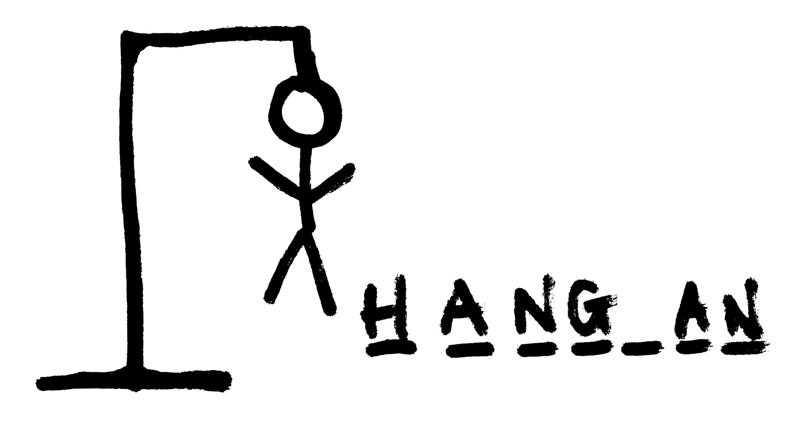
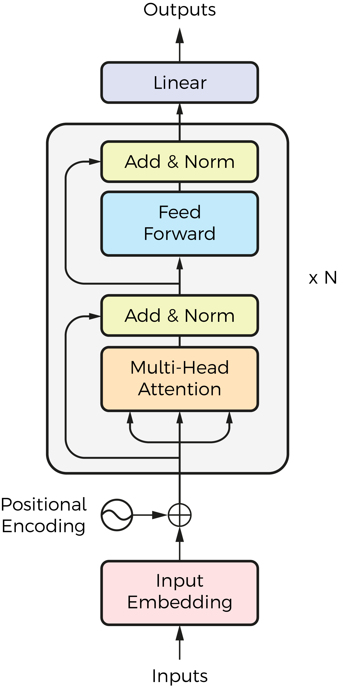
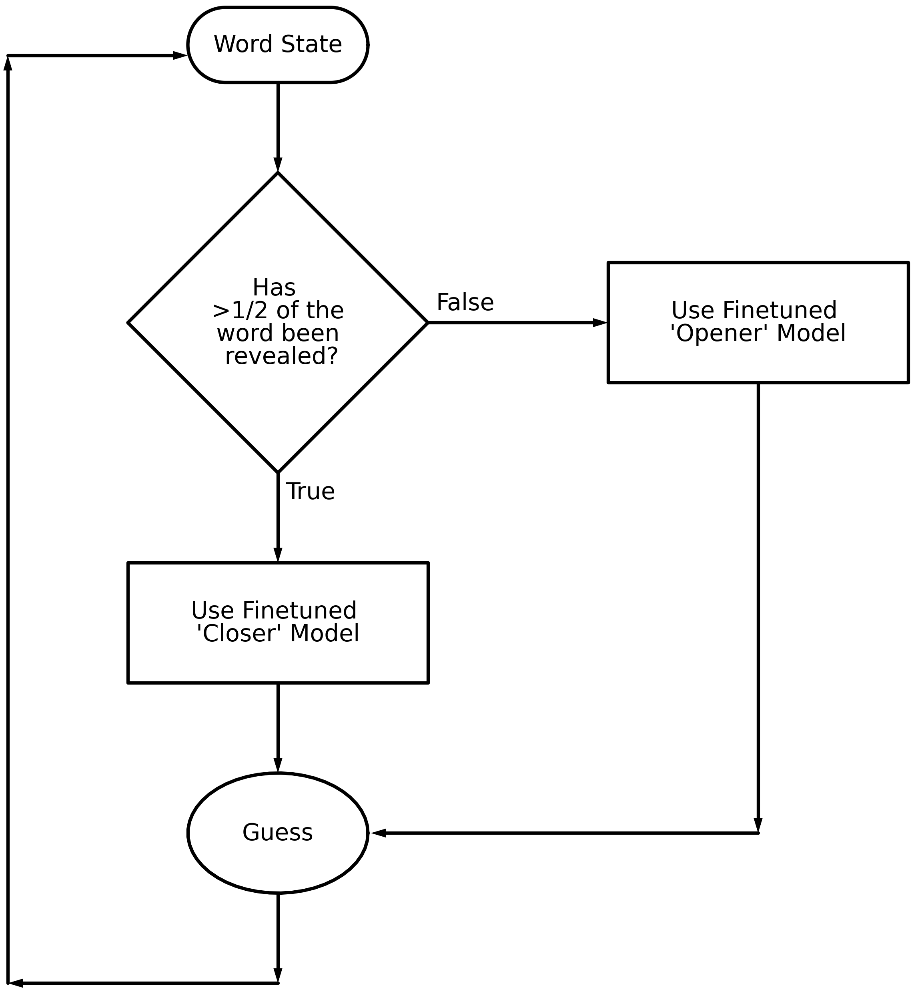
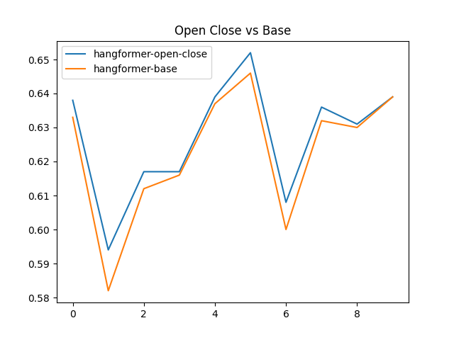
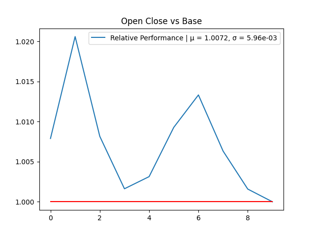
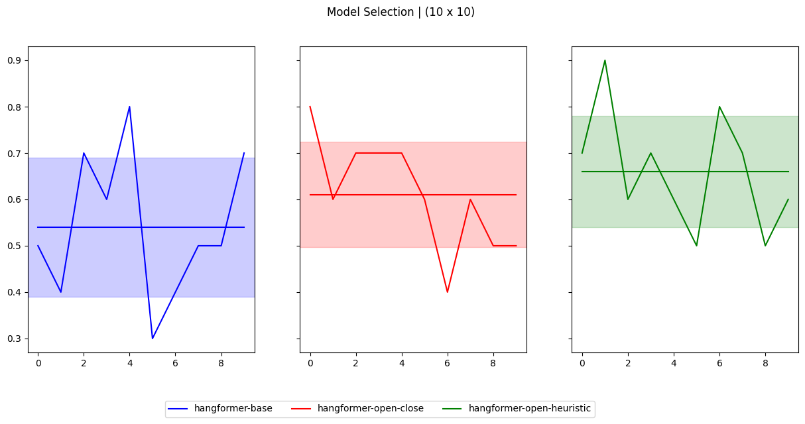

# Hangformer
Making Transformers play Hangman!

## Navigate this Repository

Check out the [Explainer Notebook](explainer.ipynb) to understand the approach and more on the model. To train your own Hangformer, run:

```sh
python train.py --train_txt data/words_250000_train.txt
```

To modify the architecture, update the [architecture.yaml](architecture.yaml) file.

Feel free to modify the code however you like!

Download the pretrained models at:
| Model    | HuggingFace 🤗    |
|-------------|-------------|
| Hangformer Base (8000 Episodes) | [Download](https://huggingface.co/1rsh/hangformer/resolve/main/episode_8000.pth) |
| Hangformer Opener (100 Episodes) | [Download](https://huggingface.co/1rsh/hangformer/blob/main/open_100.pth) |
| Hangformer Closer (400 Episodes) | [Download](https://huggingface.co/1rsh/hangformer/resolve/main/close_400.pth) |


## Problem Statement

The Hangman game is a classic word-guessing game where the objective is to guess the letters of a hidden word. One player selects a secret word, and the other guesses letters until they either reveal the word or make six incorrect guesses.



The task was to programmatically guess a letter based on the current state of the word (with underscores) using a training set of approximately 250,000 dictionary words. The benchmark algorithm, which guessed the most frequent unguessed letter, achieved an 18% success rate.

This project involved developing a hybrid approach combining an encoder-only transformer model (Hangformer) and statistical analysis for the final three guesses.

---

## Methodology

### Model Overview: The Hangformer

The **Hangformer** model was designed with an encoder-only transformer architecture, well-suited for Masked Language Modeling tasks. It processed inputs using a custom character-level tokenizer:
- Letters `a-z` mapped to integers `0-25`
- `[MASK]` represented as `26`
- `[PAD]` represented as `27`

The model's input included:
1. The current state of the word.
2. Letters guessed so far.
3. Remaining attempts.

These features were combined and passed through the transformer encoder, followed by fully connected layers for prediction.



---

### Key Approaches

#### 1. Separate Opening and Closing Models


 

- **Training**: 
  - Initial training with 8,000 episodes, each containing ~500 games.
  - Fine-tuning: Two separate models:
    - **Opener Model**: Guessed the first half of the word.
    - **Closer Model**: Guessed the second half.
- **Prediction Flow**:
  - The Opener model predicted the first half of the guesses.
  - The Closer model predicted the remaining guesses.

#### 2. Statistics-Assisted Hangformer

This method used the Opener Hangformer for predictions, except for the final three guesses, where a statistical approach improved accuracy.


---

### Statistical Heuristic: `guess_heuristic`

1. **Filter Words**:
   - Filter the dictionary to include words matching the length and known pattern of the target word.
   - Example:
     ```text
     new_dictionary = {
         word for word in full_dictionary 
         if len(word) == len_word and matches_pattern(word, clean_word)
     }
     ```

2. **Compute Frequencies**:
   - Calculate frequency scores for each letter using n-grams, prefixes, and suffixes:
     ```text
     freq_table_lat[letter] = sum(
         (10^i * n_seq_freq_list[i]) + 
         (10^i * prefix_freq_list[i]) + 
         (10^i * suffix_freq_list[i])
     )
     ```

3. **Penalize Vowel Dominance**:
   - Reduce vowel frequencies if their count significantly exceeds consonants:
     ```text
     freq_table_lat[v] /= 10  # For vowels a, e, i, o, u
     ```

4. **Select Next Guess**:
   - Choose the unguessed letter with the highest frequency score:
     ```text
     guess = argmax(
         letter not in guessed_letters
         for freq_table_lat[letter]
     )
     ```

---

## Results



The models were evaluated on a test set of 100 random words:

1. **Separate Opening and Closing Models**:
   - Improved prediction success rate compared to the base model.

2. **Statistics-Assisted Hangformer**:
   - Achieved a final success rate of **66.2%** when tested on 1,000 unseen words.

